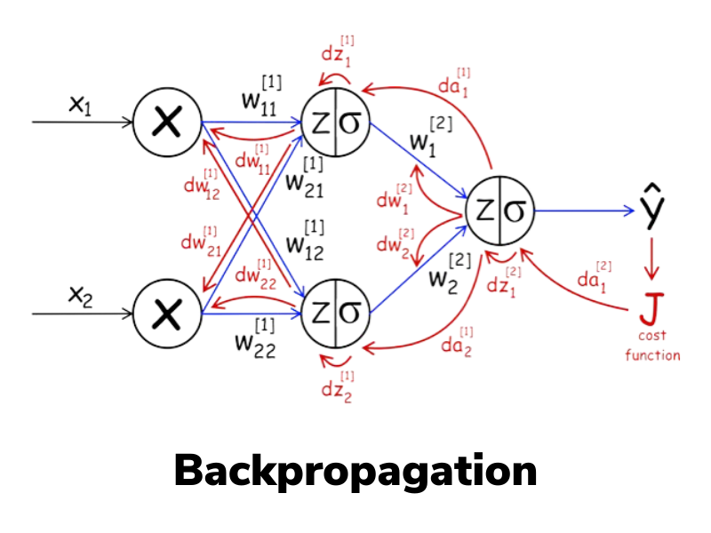

# Neural Network
Make a resource of neural networks with its complete information, all you know, and learn its implementation in pytorch, then move on to transformers.
Claude Code review: https://claude.ai/chat/1f10a1e4-be59-4960-8abf-96901ddc39da

## Forward Pass
- The first layer of the nn receives the input and each input row is passed to every single neuron in the layer which calculates 
z= W.X + b, and applies activation function on it to produce the output of the neuron, which in turn is passed to every single neuron in the next layer.
- This activation that a neuron produces acts like a feature of its own to the next layer.
- The choice of activation, depends on the requirements of the model.
Examples: Linear, ReLU, Sigmoid, Softmax, etc.
- Ultimately the final layer produces an output for the required input.
- The no of neurons in the final layers depends on the type of output desired.

## Loss Calculation
- Means how to formulate the difference between the predicted value by the model and the actual value (label) of the datapoint.
The algorithm/formula to choose for calculating the loss depends on the type of value produced by the model, and other factors.
- Binary Classification: Cross Entropy?
- Linear Regression: Mean Absolute Error or Mean Squared Error
- Multi class classification: Sparse Categorical Cross Entropy (what is this?)  

## Cost Backpropagation
- We know the aggregated loss ie. the cost of the model.
- Now we need to know that by what amount do we change the weights of the model, so that the cost of the model is reduced.
- There are a lot of methods for this but the most commonly taught is backpropagation:
    - we calculate the derivative of cost wrt each parameter in the model by first doing it for the weights/activations close to the actual 
    cost calculation and then using chain rule to calculate the derivative wrt weights that are far from last layer.
    
- In the above image, we calculate the derivative wrt the activation of last layer, and then that of whatever weight/(prev. layer activation) directly affects the last layer activation, using chain rule, and so on.. till the very first layer weights.

1. The rate of change wrt an activation is derived from all the activations of next layer because this activation is fed to all the neurons of next layer and derivative of cost wrt them is dependent on this activation too.(Chain rule.)
2. The rate of change wrt w's weights is equal to activation values which are different for each training example, hence the net rate of change wrt w weights is the mean of respective activation of all training examples.\

## Parameter update.
- Now we know how much changing (increasing) the value of a weight by a small margin will affect the cost of the model. We use this to update the weight accordingly. 
- This formula is commonly used to update the weights:
w=w-learning_rate*(dJ_dw)
1. Learning_rate: So that we don't suddenly increase the weight by too much and the new value is detrimental to the model. We want to keep the learning rate low so that we slowly reach the optimal value of the weight which produces minimal loss.
2. Derivative: This is just a numerical indicator, its value doesn't mean that changing the weight by this much amount will decrease the loss, this is just a number and we multiply it by a small learning rate so that it's value isn't too much. What matters is it's sign, whether increasing the weight increases the cost or decreases it.
3. Subtraction: 
a. If increasing weight increases the cost ie derivative is positive, this means that we should decrease the weight instead, here -ve sign in the formula is beneficial because in this case it results in decrease of weight. 
b. If increasing the weight decreases the cost ie derivative is negative, this means that we should increase the weight and the -ve sign in the formula will result in increase of weight.

