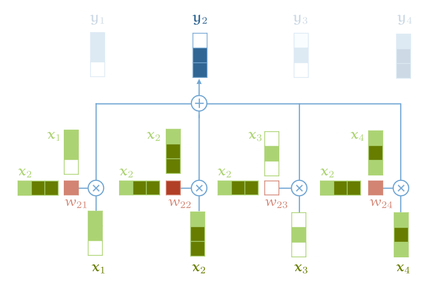
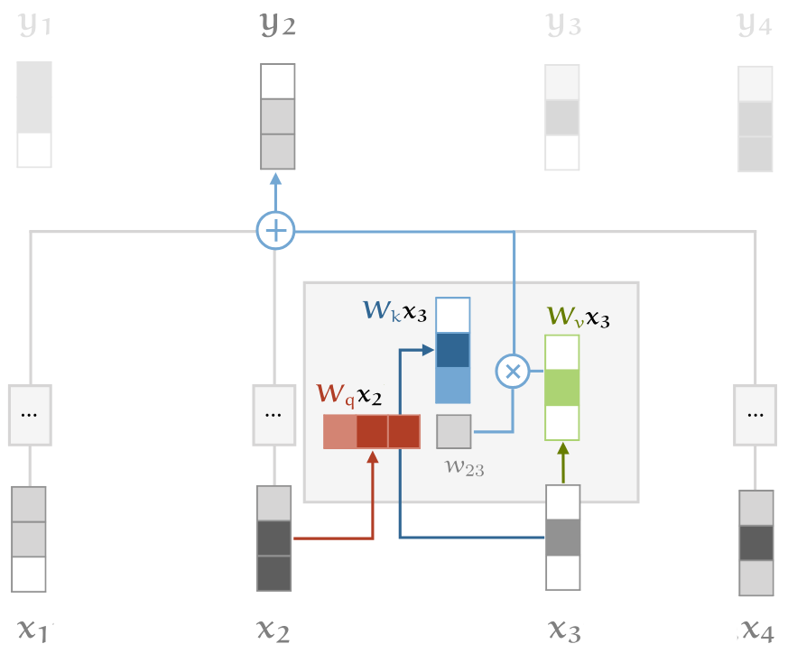
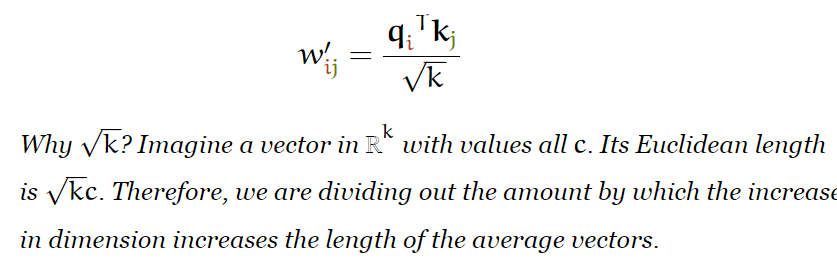
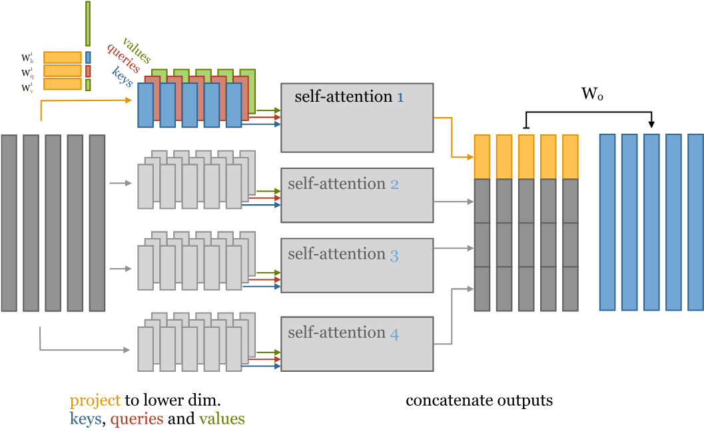
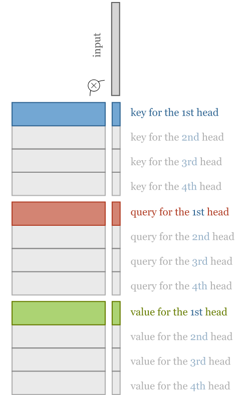
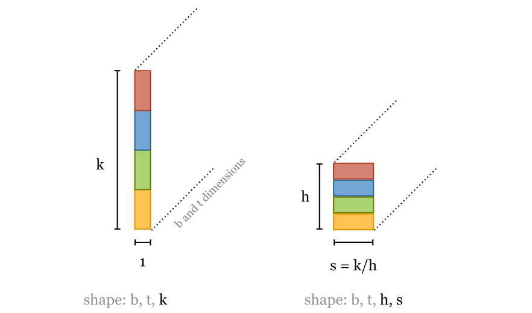

# Self Attention:

For a set of input vectors => we calculate a set of output vectors.
Each output vector is build of the weighted average of all the input vectors.
The weights however, are calculated in a special manner, which is the heart of self attention.
The weight corresponding to each input vector will denote how similar the current input vector is to the input vector whose corresponding output vector is being calculated.

Say we want to find op vector Yi for ip vector Xi.
Yi = sigmaJ(Wij.Xj)

where Wij is a number between 0 and 1 and denotes how similar Xi and Xj are.

Wij' = Xi.Xj

Wij = exp(Wij')/sigmaJ(exp(Wij'))

The more similar two input vectors are, the more the value of their weight and the more that input vector would contribute to the output vector.

- These vectors correspond to words, and how similar two words are, varies from context to context. Hence, how to convert a word to a vector must be done carefully for this process to work.

- Sequence of words doesn't play a role in which set of output vectors would be there. Because whatever is the permutation of input words, the same output word sequence would be there, except permuted.

*Ques: How does self-attention contribute to learning/inference in transformers?*
- So far, it seems that this only leads to new words that are most similar to set of words of the previous layer. Where is the understanding here?
- Self attention leads to a set of outputs, each corresponding to an input and the output is kind of combination of all the inputs weighted by their similarity with THE input.
- What makes this mechanism unique is its ability to formulate similarity between inputs, whereas architectures like neural networks generate the output from the inputs without considering operations between vectors.

## Parameters
- So far, we did not have any parameters in the self-attention architecture and the ouputs were dependent on the input only.
- But, we have three additional tricks for the transformer architecture to work (and how they were implicitly present in above arch): 
For each vector:
1. Queries: What it wants (dot product with other vectors to calculate it's weight)
2. Keys: What it provides (dot product with other vectors to calculate THEIR weight)
3. Values: It's value (it's value used in the weighted sum)

- originally, these input and output vectors and vertical i.e. of dimensions: k*1.

- So, for each input vector, we'll calculate three linear transformations using three different k* k parameters to give k*1 vectors:
1. qi = Wq.xi, query transformation of the ith vector 
2. ki = Wk.xi, key transformation of the ith vector
3. vi = Wv.xi, value transformation of the ith vector

These will be used to calculate query, key and output of ith vector, instead of using the input vectors directly.

wij` = (qi.T).kj

wij = softmax(wij) over j

yi = sigma(wij.vj) over j

Now, the calculation of output vector involves weights (Wq, Wk, Wv), which can be optimized.

- To stop the inputs to softmax, i.e. wij' from increasing too much, we scale it by the root of number of dimensions.

### Multi-Head Attention
-An output vector, gives emphasis to input vectors based on dot product values i.e. how similar the corresponding input vector is to the other input vector.
- Now consider an example:
- Mary gave roses to susan.
- Here we have no way to differentiate who gave the roses and who receives the roses because we only identify important words using dot product, which cannot be used here to do the differentiation.
- In a single self-attention operation, all this information just gets summed together. The inputs 𝐱mary and 𝐱susan can influence the output 𝐲gave by different amounts, depending on their dot-product with 𝐱gave, but they can’t influence it in different ways. If, for instance, we want the information about who gave the roses and who received them to end up in different parts of 𝐲gave, we need a little more flexibility.
- There was no way to understand semantics of the sentence. Maybe can be done with careful conversion of words into embeddings.

**Multiple heads**
- We can combine multiple self attention operations on the same set of input vectors. Each operation is called attention head.
- Each head has different weights (Wq)r, (Wk)r, (Wv)r and will generate different (Yi)r for an input vector xi which can then be transformed to generate the final output Yi with dimension k*1.
- <em>How can Multi-head attention be slower even when computed in parallel?</em>

**Making multi-head self attention efficient**
- Instead of using k*1 query, key or value vectors, we reduce their dimensionality by carefully deciding dimensions of weight matrices.
- For h heads and k* 1 input vectors, we use weight matrices of dimensions: (k/h). which leads to modified input and subsequently output vectors of dimensions (k/h)*1
- We then concatenate and transform the output vectors to give the original dimension of k*1

- The total no of parameters in multi-head attention(h* 3* k/h* k) and single head self attention(3* k* k) remain the same, except for the W0 matrix which adds k*k parameters.
- We can even implement this with just three k×k matrix multiplications as in the single-head self-attention. The only extra operation we need is to slice the resulting sequence of vectors into chunks.

- The overall idea here is doing computations with lower dimension size instead of higher dimensions directly, to save computation costs.

- Still not sure, how this solves the original problem of self-attention being unable to understand semantics.

*Ques: How does self-attention incorporate long-range dependencies? Does it have the complete input as input to each level of self attention so that dot product is calculated between each pair of words?*
- Question is basically how do you handle input that exceeds sequence length.

## After Self-Attention
- We input the output of self-attention to a multi-layer perceptron.
- And what purpose does that serve other than simply fitting to the input data.

QUES: Why does attention & this combination of attention and MLP yield results so good?

## Layer Normalization
- Used to keep the data from getting too large for calculation?
- Applied after each attention and each MLP operation.
- Combines residual connections with the input to generate the output. The residual connections help maintain the identity of data and limit the effect of operation on it?